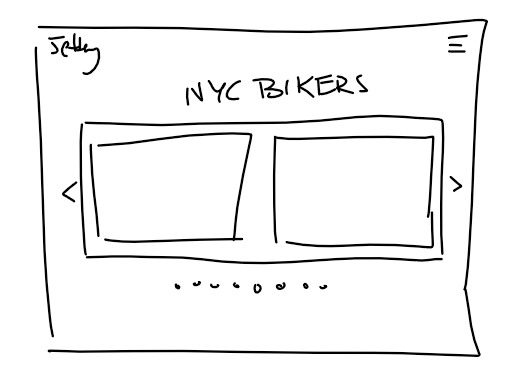
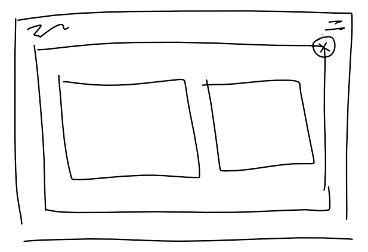
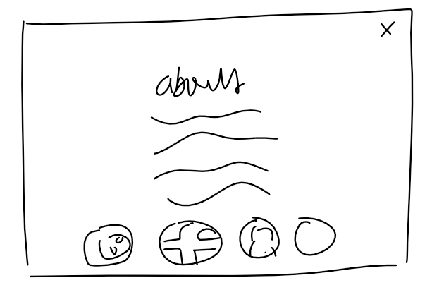
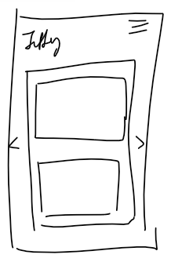
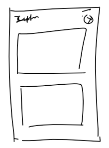
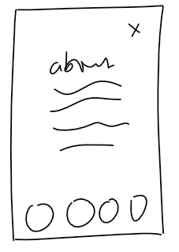

## Final Proposal

I want to continue my midterm project of the gallery.
This is will be a more organized version of the midterm project.
I will be using bootstrap to make the site look more professional.
Also, the photos will be organized by each photo's counterpart. This 
would follow something like this: 
(presentation)[https://docs.google.com/presentation/d/119BNfyQMIC4UiHjPvXfCGAd_hie1OxZhZtTVO6tqLKY/edit?usp=sharing].
\

Each photo has something to be juxtaposed with it. For example, a photo of a biker 
looking left would have another person looking left. Also my main 
goal with implementing javascript is to make the site more interactive.
\

Here are the wireframes for the site:
\

\
\

and then here are the mobile wireframes:
\

