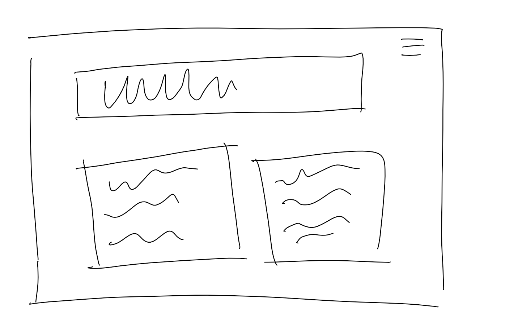
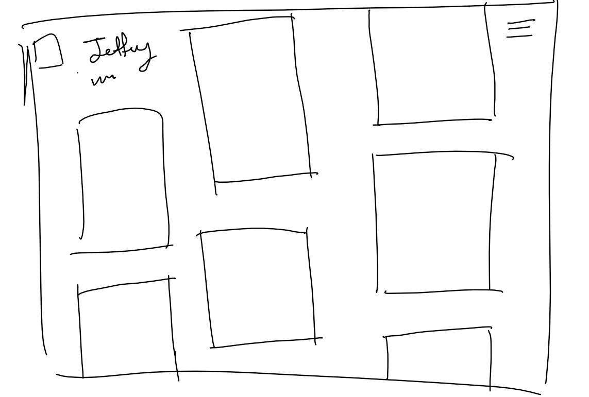
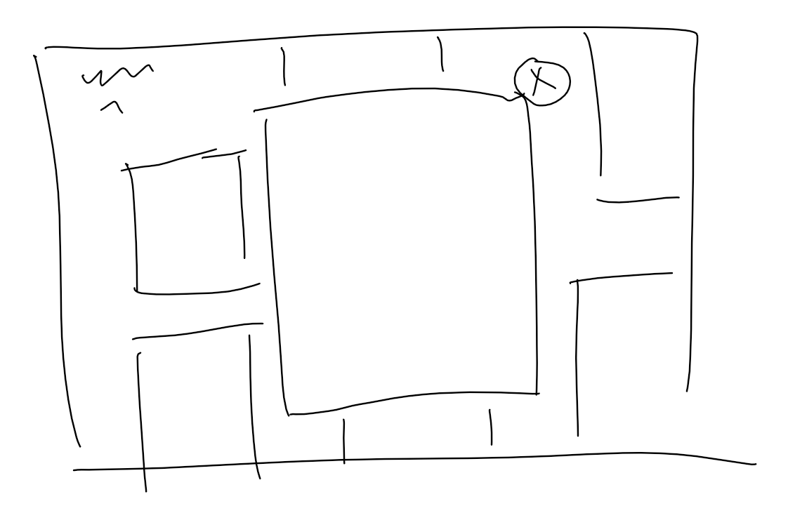
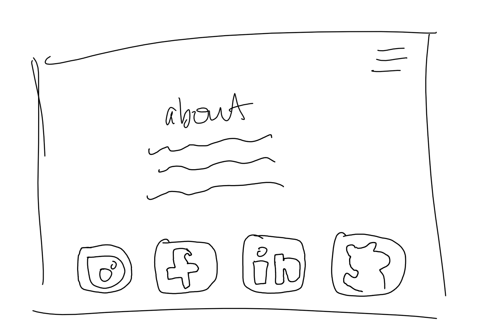

###wire framing a proposal for midterm project

This was the original simple wire frame that I thought I would make.

Then, after realizing that I don't have much text to write, I thought it 
would be interesting to put some pictures from my digital photography course 
on a webiste to make it more of an artitistic portfolio.

here is the wire frame for the new homepage:

here is what would happen when you click on an image:

here is what would happen when you click on the hamburger menu:
